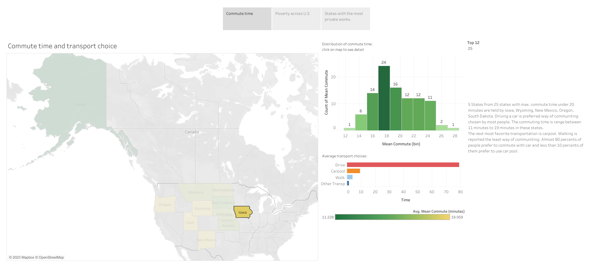
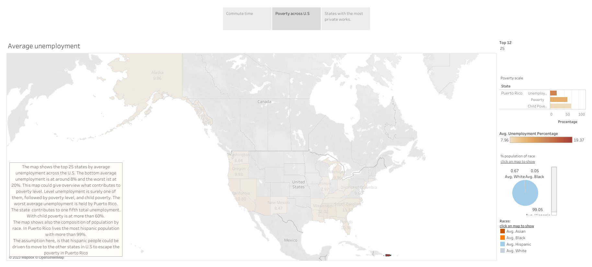
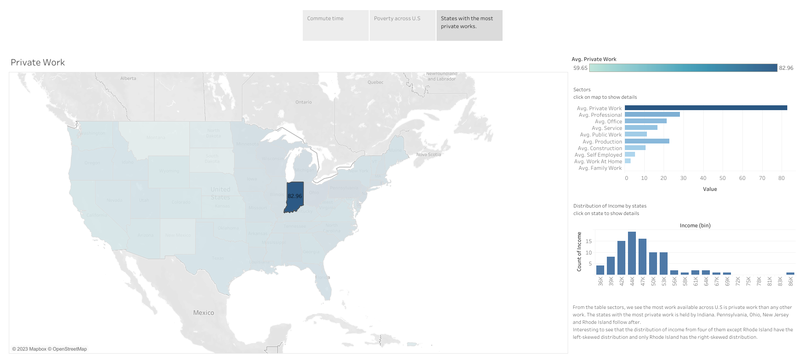

# Data Visualization with Tableau : US Census Demographic Data 2015

In this project, the visualizations to reveal insights from a data set tell stories and highlight patterns in US Census Demographic Data. It is a reflection of the theory and practice of data visualization, such as visual encodings, design principles, and effective communication.

This data comes from a Kaggle dataset, it includes the census data for all counties in 2015.

In the dashboard there are three visualizations. Some questions that I attempt to answer including following areas:

1. **Which states have the best transportation based on commute time?**

2. **How does income and poverty look across America?**

3. **Where are the private works concentrated across America?**

The link to the Tableau dashboard where the details can be seen clearer can be found on this link: 
    https://public.tableau.com/app/profile/black7145/viz/udacity-usincomepopulation/Story1?publish=yes

## 1. **Which states have the best transportation based on commute time?**




## 2. **How does income look across America?**



## 3. Where are the private works concentrated across America?




```python

```
